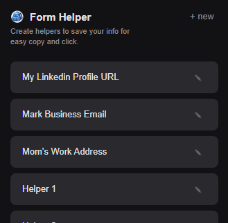
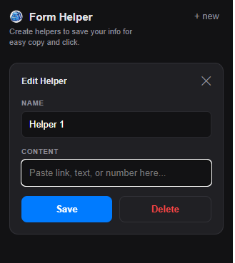

# Form Helper (Backpack) 🎒

A minimalist Chrome extension for developers and job seekers to store and quickly copy frequently used text strings (LinkedIn URLs, Portfolios, Email addresses) that standard autocomplete often misses.

## Features
- **One-Click Copy:** Click any saved item to copy it to your clipboard.
- **Developer Theme:** Clean, dark-mode interface with a 2-column grid.
- **Cloud Sync:** Uses `chrome.storage.sync` to keep your links available across any Chrome browser you're logged into.
- **Local Control:** No external servers, no tracking, and no data collection.

## Installation (Developer Mode)
1. Clone or download this repository.
2. Open Chrome and navigate to `chrome://extensions/`.
3. Enable **Developer mode** in the top right corner.
4. Click **Load unpacked** and select the folder containing these files.

## Security & Privacy
- This extension does **not** communicate with external servers.
- All data is stored within your Google Chrome profile.
- **Warning:** Do not store sensitive information like passwords, SSNs, or credit card numbers.